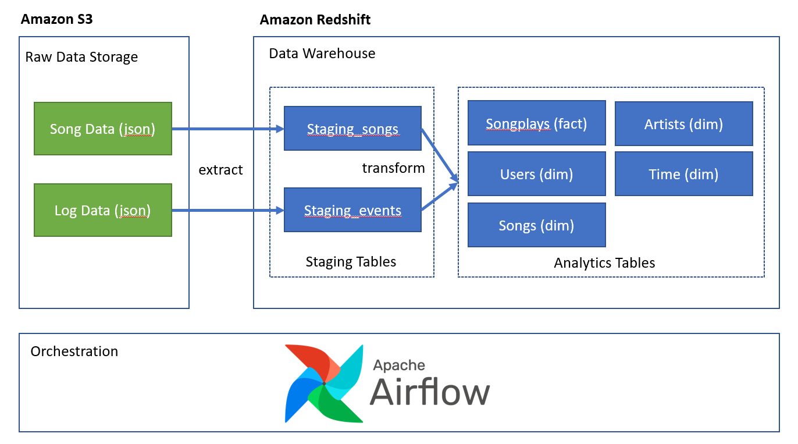
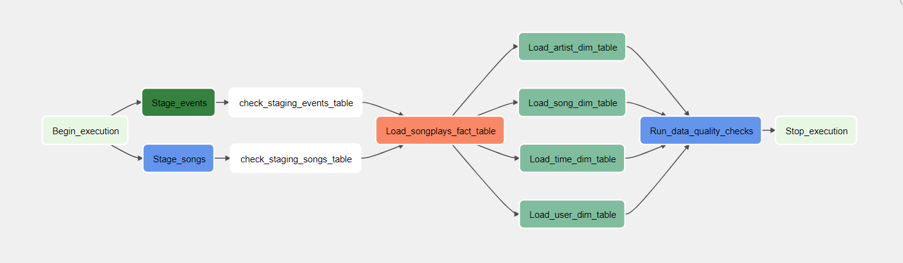
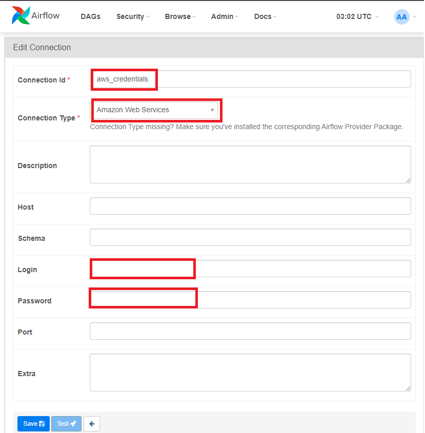
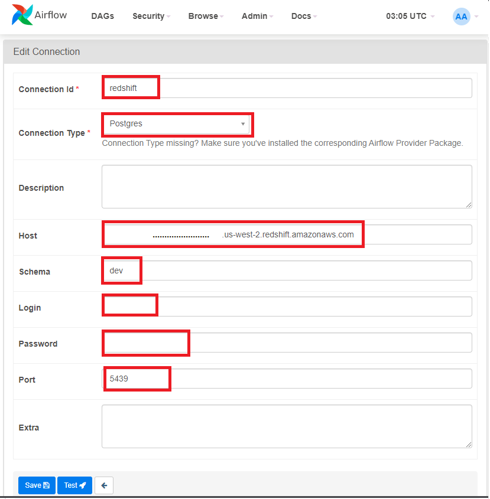

# Sparkify Data Pipeline using Airflow

## Introduction
This project is part of Udacity Data Engineering course. Sparkify, a hypothetical music streaming company would like to have more automation and monitoring to their data warehouse ETL pipelines. They have decided to use Apache Airflow to achieve that.

The objective of the project is to create high grade data pipelines that are dynamic and built from reusable tasks, can be monitored, and allow easy backfills. Since the data will impact the company decision, data quality is paramount, a data quality check needs to be included in the ETL to catch any discrepancy.

The source data resides in S3, and the data warehouse resides in Amazon Redshift.




## Table of Contents
  * [Introduction](#introduction)
  * [Technologies](#technologies)
  * [Airflow DAG Design](#airflow-dag-design)
  * [Prerequisites](#prerequisites)
  * [Setup](#setup)


## Technologies
The project is created using the following technologies:
- Apache Airflow 2.3.3 (run using docker)
- AWS Redshift (Data warehouse)
- AWS S3 (Raw data storage)
- Docker
- Python

## Airflow DAG Design
This project consist of 2 dags:
### sparkify_create_tables_dag.py
This dag creates all the necessary tables in our redshift cluster. It is supposed to be run once and everytime we want to clear our tables.

These are the list of tables created:
#### Staging tables
- staging_events
- staging_songs

#### Dimension and Fact Tables
- artists (dim table)
- songplays (fact table)
- songs (dim table)
- users (dim table)
- time (dim table)

### sparkfiy_etl_dag.py
This dag does the ETL from S3 to Redshift in hourly interval
These are the DAG graph:

- `Begin_execution`: start of the dag
- `Stage_events`: clear the staging_events table and copy the daily events' data from S3 to Redshift staging_events table
- `Stage_songs`: clear the staging_songs table and copy the songs data from S3 to Redshift staging_songs table
- `check_staging_events_table`: check that the data is loaded in staging_events table
- `check_staging_songs_table`: check that the data is loaded in staging_songs table
- `Load_songplays_fact_table`: upsert the daily songplays data into songplays table (to ensure no duplicates)
- `Load_artist_dim_table`: clear the artist table and insert the artist data into artists table
- `Load_song_dim_table`: clear the song table and insert the songs data into songs table
- `Load_time_dim_table`: clear the time table and insert the time data into time table
- `Load_user_dim_table`: upsert the user data to users table (to ensure no duplicates)
- `Run_data_quality_check`: check the fact and dimension tables column to ensure the value are correct
- `Stop_execution`: end of the dag

## Prerequisites
In this project, we run Apache Airflow using docker in our local machine, hence we need to have the docker and docker-compose installed in our machine:
- Install Docker following the instruction [here](https://docs.docker.com/engine/install/)
- Install Docker Compose following the instruction [here](https://docs.docker.com/compose/install/)


## Setup
### Running Apache Airflow Docker
The docker-compose provided in this repository is customized for our use case from docker-compose file provided by airflow [here](https://airflow.apache.org/docs/apache-airflow/stable/start/docker.html#docker-compose-yaml) 
  - Create a `.env` file in the root directory of this project, and add these two values:
```commandline
AIRFLOW_UID=50000
AIRFLOW_HOME="<insert the absolute path to this project root directory>"
```
- Initialize airflow database. Open your command line, go to the project directory and run this command
```commandline
docker-compose up airflow-init
```
- Start running airflow. Open your command line, go to the project directory and run this command
```commandline
docker-compose up
```
- The airflow web interface is available at http://localhost:8080

### Setup AWS user and Redshift
#### Create an AWS Account
Please follow the instruction on this [link](https://aws.amazon.com/premiumsupport/knowledge-center/create-and-activate-aws-account/)

#### Create a new IAM User
In this project, we are going to access AWS S3 from Airflow, hence we need the AWS credentials
Please follow this step to create one:
- Go to AWS IAM service and click on the "Add user" button to create a new IAM user in your AWS account.
- Choose a name of your choice.
- Select "Programmatic access" as the access type. Click Next.
- Choose the Attach existing policies directly tab, and select the "AdministratorAccess". Click Next.
- Skip adding any tags. Click Next.
- Review and create the user. It will show you a pair of access key ID and secret.
- Take note of the pair of access key ID and secret. This pair is collectively known as Access key.

#### Create a Redshift cluster
- Create a Redshift Cluster in us-west-2 region
- Set the cluster to be publicly accessible following this [instruction](https://aws.amazon.com/premiumsupport/knowledge-center/redshift-cluster-private-public/) so Airflow can access it

### Set the Airflow connections
Access your airflow web UI and add the following connections in Airflow:
- Create connection `aws_credentials`, set the connection type as `Amazon Web Services`, put the value of the AWS user `Access key ID` as the `login` and `Secret code` as the `Password` 

- Create connection `redshift`, set the connection type as `Postgres`, get the host name from your AWS Redshift cluster and put the value in `host`, put the schema as `dev`, fill in the `login` and `password` with the admin credentials you specified in your AWS Redshift, and lastly put the port as `5439`


#### Create the tables for staging, fact, and dimensions
In your Airflow UI go to DAGs tab, and enable dag `sparkify_create_tables_dag`
By running this dag, all the necessary tables in Redshift are created. If there are existing tables, those will be dropped and recreated.

#### Run the ETL dag
In your Airflow UI go to DAGs tab, and enable dag `sparkify_etl_dag`
By running this dag, it will run hourly ETL jobs to stage data from S3 to redshift and generate the analytics table.


